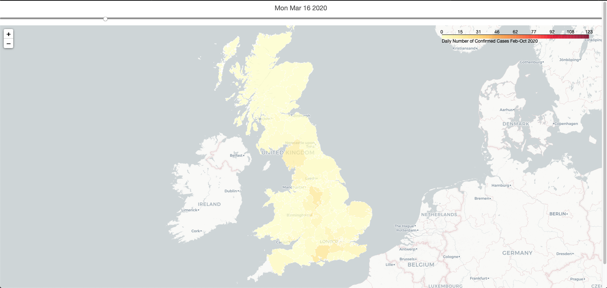
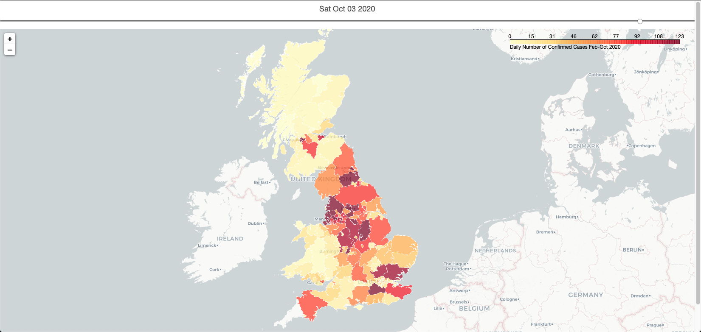

# Interactive Chloropleth Maps with Folium and Geopandas
A guide on how to create interactive html or static png/pdf maps of a chosen variable broken down by a chosen geography level and date using the python programming language and supporting libraries. 

Author: Richard Haigh

Date of Intial Upload: 27/10/2020

Written - Python 3.8.6

Environment: PyCharm 2020.2.3

Packages: Geopandas 0.8.1, numpy 1.19.2, pandas 1.1.2, folium 0.11.0, contextily 1.0.1, Fiona 1.8.17, GDAL 3.1.3, selenium 3.141.0, branca 0.4.1 

This is intended to be a guide for analysts and statisticians with a mid-level knowledge of Python and programming fundamentals, that will aid them in creating 
a variety of interactive chloropleth maps that would be suitable for enhancing dashboard data visualisations and application UX.  Mapping with open-source software is not easy but can greatly help extract the greater picture from your datasets. 

You can use this with an existing dataset providing it has a breakdown of your chosen geography level. You must also have access to the software stated above and the ESRI shapefiles of your chosen geography. These are too large to host on github repositories but can be found at spatialdata.gov.scot.

Install of geospatial mapping software for Python requires geopandas and several key dependencies. Install using minicondas or homebrew is recommended, rather than pip for this reason. A guide to install can be found here: https://geopandas.org/install.html. 

This repository will be broken down into several stages that should be worked through linearly. 

Data will be coronavirus cases by UK local authority from February to October 2020. This data is contained in this repository in csv format. Guidance on download 
of shapefiles will be within the py file. 

# Stage 1: Create Simple Folium Chloropleth Maps
Use this if you wish for an html, pdf or png output file that shows your desired geography level breakdown (be it LA, DZ or HB) and wish to shade each geog area by a given variable such as population, wealth or any other quantifiable numeric measurement. If you use an html output file then you can retain the interactive user properties this format allows, similar to JS leaflet, such as navigation and zoom. 

For this guide follow the folium_chloropleth_maps.py file in this repository. This will allow customisable output such as: 

# Stage 2: Interactive Time Series Chloropleth Maps
Once you have completed stage 1, we may revisit the dataset in order to create an interactive map that allows us to track the changes in our given variable over a specific time period, rather than just viewing a static snapshot. Use the file time_series_maps.py if you wish to add an additional level of analysis to visual aids in your applications or dashboards. 

The nature of the output does not allow for extracting in .pdf or .png format but screenshots will allow us to demonstrate the use of the time slider function:

